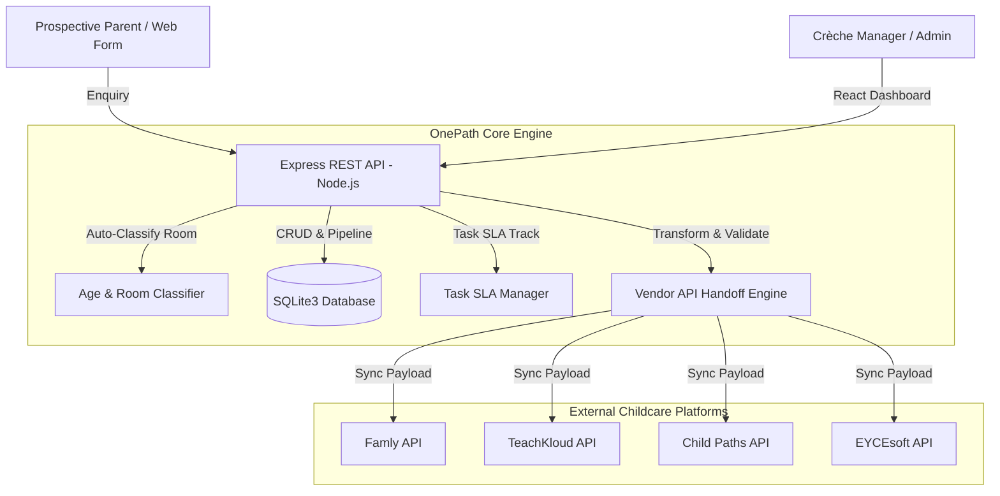
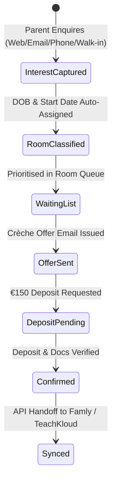
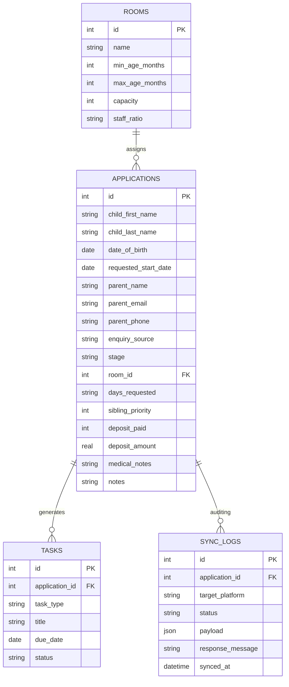

# OnePath Enrollment Manager - System Architecture 🏗️

This document outlines the technical architecture, data model, component interaction, and interoperability design of the **OnePath Enrollment Manager** application.

---

## 📐 High-Level Architecture Overview

OnePath operates as a vendor-neutral pre-enrolment workflow intelligence layer above operational childcare management platforms.



---

## 🛠️ Technology Stack Breakdown

| Layer | Component | Description |
|---|---|---|
| **Frontend** | React 18 + Vite | SPA featuring dark-mode glassmorphism design system (`index.css`), Kanban board (`PipelineKanban.jsx`), Data Table (`EnquiriesTable.jsx`), and interactive modals. |
| **Backend** | Node.js + Express | Modular REST API server (`server/index.js`) and Vercel Serverless Function (`api/index.js`). |
| **Database** | SQLite3 (`better-sqlite3`) | Local zero-configuration file database (`server/enrollment_manager.db` / `/tmp/enrollment_manager.db` on Vercel). |
| **Serverless Deployment** | Vercel Platform | Pre-configured `vercel.json` routing `/api/*` to Express Serverless Handler and static assets to React Vite bundle. |
| **Interoperability** | OnePath JSON Payload | Standardized JSON payload transformer mapping prospective child & guardian attributes to destination platform schemas. |

---

## 🔄 Pre-Enrolment Pipeline Lifecycle & Data Flow

Prospective child applications progress through 6 distinct stages:



1. **`interest_captured`**: Initial expression of interest recorded.
2. **`classified`**: Age in months calculated at target start date to determine room classification.
3. **`waiting_list`**: Managed in room priority queue (supporting sibling priority).
4. **`offer_sent`**: Official offer issued with offer ageing SLAs.
5. **`deposit_pending`**: €150 deposit tracking & birth certificate verification.
6. **`confirmed`**: Approved and ready for single-click API handoff.

---

## 🏛️ Irish Early-Years Crèche Room Classification

OnePath automatically enforces regulatory Irish staff ratios and age brackets:

| Room Name | Age Range | Staff Ratio | Capacity Limit |
|---|---|---|---|
| **Baby Room (Buttercups)** | 0 – 12 Months | `1:3` | 9 |
| **Wobblers & Toddlers (Daisies)** | 12 – 24 Months | `1:5` | 12 |
| **Playgroup & Junior Preschool (Sunflowers)** | 24 – 36 Months | `1:6` | 18 |
| **ECCE Preschool Room A (Oak)** | 36 – 60 Months | `1:11` | 22 |

---

## 🗄️ Database Entity-Relationship Diagram (SQLite)



---

## 🔌 Vendor Integration & Handoff Specification

When a child record reaches `confirmed` stage, OnePath normalises the record into the standard `OnePath Payload Format`:

```json
{
  "onepath_reference_id": "OP-ENROL-6",
  "export_timestamp": "2026-07-27T21:44:00.000Z",
  "destination_platform": "Famly",
  "child_details": {
    "first_name": "Maeve",
    "last_name": "Doyle",
    "date_of_birth": "2022-09-18",
    "requested_start_date": "2026-09-01",
    "assigned_room": "ECCE Preschool Room A (Oak)",
    "days_requested": "ECCE Morning Session",
    "medical_notes": "Peanut allergy"
  },
  "guardian_details": {
    "full_name": "Sean Doyle",
    "email": "sean.doyle@example.ie",
    "phone": "+353 89 222 1111"
  },
  "financial_status": {
    "deposit_paid": true,
    "deposit_amount_eur": 150.00
  },
  "onepath_audit": {
    "enquiry_source": "Walk-in",
    "enrolled_at": "2026-06-15 13:20:00",
    "sibling_priority": true
  }
}
```
